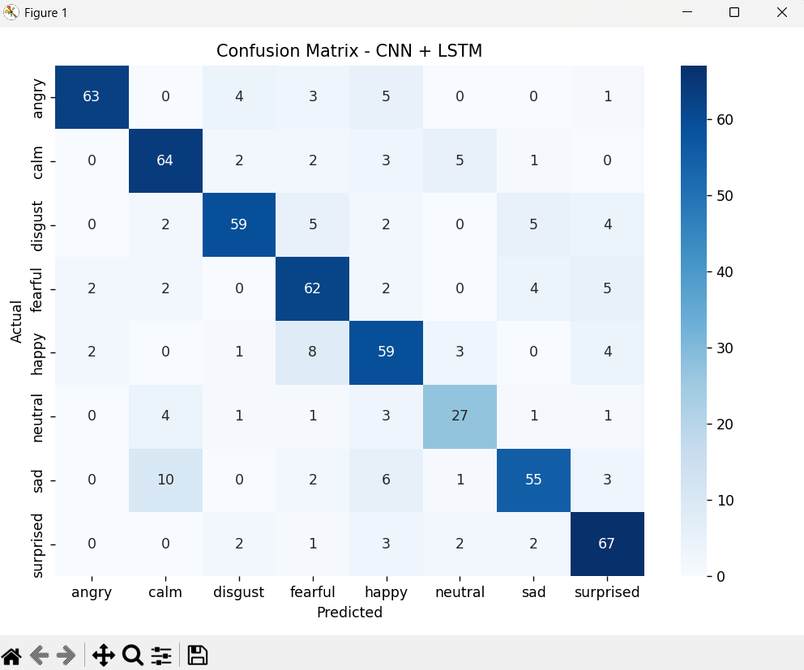
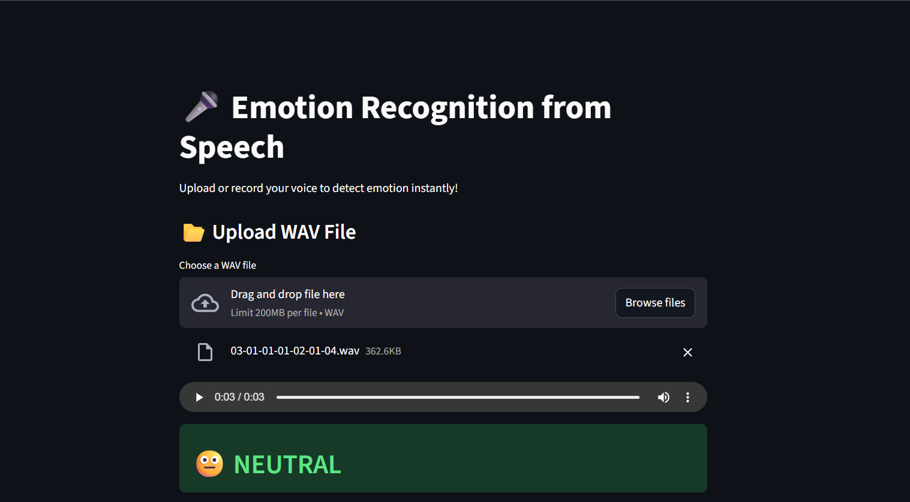

🎤 Emotion Recognition from Speech using Deep Learning
📌 Project Overview

This project implements an end-to-end deep learning system for Emotion Recognition from Speech.
The system analyzes speech audio and classifies the emotional state of the speaker using MFCC feature extraction and deep learning models.

The final deployed solution includes a trained CNN + LSTM model and a Streamlit web application for real-time emotion prediction.

🎯 Objective

To build a robust deep learning model capable of detecting human emotions from speech recordings by learning both spatial and temporal patterns in audio signals.

📂 Dataset

RAVDESS (Ryerson Audio-Visual Database of Emotional Speech and Song)

Emotions included:

Angry

Calm

Disgust

Fearful

Happy

Neutral

Sad

Surprised

The dataset contains professionally recorded emotional speech samples.

🔬 Feature Extraction

Audio signals are converted into numerical features using:

40 MFCC (Mel-Frequency Cepstral Coefficients)

Audio padded/truncated to 174 time frames

Transformed into time-series format for sequential modeling

MFCC was chosen because it effectively represents frequency characteristics of human speech and is widely used in speech processing tasks.

🧠 Model Development & Improvement
🔹 1. Baseline Model – CNN

Initially, a Convolutional Neural Network (CNN) model was implemented.

2D CNN layers

MaxPooling

Dropout for regularization

Dense classifier

The CNN learned spatial patterns in MFCC features.

Performance:

Test Accuracy: ~0.48

Macro F1-Score: ~0.45

While the CNN captured frequency patterns, it struggled with temporal dynamics of speech.

🔹 2. Improved Model – CNN + LSTM (Final Model)

To enhance performance, a hybrid CNN + LSTM architecture was developed.

Architecture:

1D CNN layers for spatial feature extraction

Batch Normalization for stable learning

MaxPooling and Dropout for regularization

LSTM layer to capture temporal dependencies

Fully connected Dense layers for classification

The LSTM layer enables the model to learn emotional progression over time.

📊 Final Results
Model	Accuracy	Macro F1-Score
CNN	~0.48	~0.45
CNN + LSTM	~0.79	~0.79
Key Observations:

Significant improvement after adding LSTM.

Better recognition of neutral and sad emotions.

Confusion matrix shows strong diagonal dominance.

Balanced class-wise performance.
## 📊 Confusion Matrix

## 📈 Training & Validation Curves

🌐 Web Application

A Streamlit web interface was developed for real-time emotion prediction.

Features:

Upload WAV audio file
## 🌐 Web Application Interface

Record live voice from microphone
## 🌐 Web Application Interface

Emoji-based emotion display

Confidence percentage output

Run locally:

streamlit run app.py
⚙️ Installation
1️⃣ Clone Repository
git clone <your-repo-link>
cd EmotionRecognitionFromSpeech
2️⃣ Install Dependencies
pip install -r requirements.txt
🏋️‍♂️ Train Model
python src/train_cnn_lstm.py
🎯 Predict Emotion (Command Line)
python src/predict.py path_to_audio.wav
🧩 Project Structure
EmotionRecognitionFromSpeech/
│
├── src/
│   ├── feature_extraction.py
│   ├── data_loader.py
│   ├── train_cnn_lstm.py
│   ├── predict.py
│
├── models/
│   ├── cnn_lstm_model.h5
│   └── label_encoder.pkl
│
├── app.py
├── requirements.txt
└── README.md
🔍 Key Insight

The comparison between CNN and CNN + LSTM models demonstrates that incorporating temporal modeling significantly improves speech emotion recognition performance.

CNN captures spatial patterns, while LSTM captures sequential dependencies in speech, resulting in a major performance boost.

🚀 Technologies Used

Python

TensorFlow / Keras

Librosa

NumPy

Scikit-learn

Streamlit

Matplotlib / Seaborn

🏁 Conclusion

This project demonstrates:

Audio preprocessing using MFCC

Deep learning model design and comparison

Performance evaluation using multiple metrics

Practical deployment using Streamlit

End-to-end ML pipeline development

The final CNN + LSTM model achieved approximately 79% accuracy, showcasing effective emotion classification from speech.

👨‍💻 Author

NAVODYA MAPA
Internship Project – Emotion Recognition from Speech